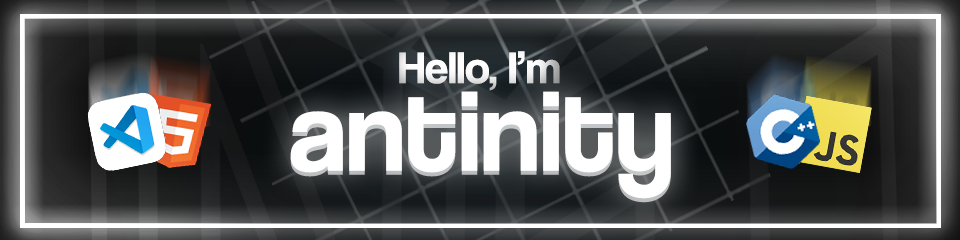

## ✨ About Me

I'm a 16-year-old student from  India who’s passionate about tech and creativity! I’m a full-stack web developer and I’m really into JavaScript, though I know plenty of other programming languages too.

#### 🎬 What I Enjoy

When I’m not coding, I love video editing, creating motion graphics with After Effects, and working with Photoshop. I also make YouTube videos where I share my projects, tips, and tech insights.

#### 💼 Commissions Open

If you need help with web development, video editing, or any graphic design work, feel free to reach out. I'm open for commissions and excited to work on new projects!

I'm always learning and excited to try new things!

## 
💻 My skills 

#### 🌐 Languages

#### 🧩 Libraries and Frameworks

#### ⚒ Tools

## 
💻 My projects 

#### Closed source
- [📊 Minemen Tier List (MMCTL)](https://mmctierlist.com/)
- [🔋 Unipower](https://myunipower.com/)
- [💻 Babsoft](https://babsoft.in/)

#### Open Source
- 📗 [***antinity/selfcord***](https://github.com/antinity/selfcord)  
A multi-purpose advanced discord selfbot full of useful features.

#

### 
⚙️ My development environment 

  <table style="font-size: 11px">
  <tr>
   
  <td valign="top" width="50%">
  

I mostly use Windows because I was born with it.
   
 

  
  
  
  
  
  </td>

  <td valign="top" width="50%">
  

I love working with Linux in the vast open-source world.

  
  
  
  
  
  </td>
  </tr>
  </table>

## Contact and Socials

#### ✉ Email: antinityfx@gmail.com

 

## Statistics

---
