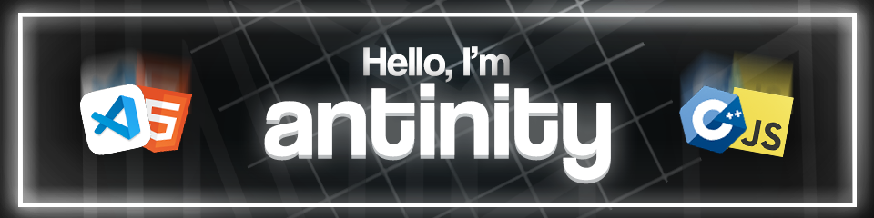

  

<h1 align="center">Hi, I'm Antinity</h1>

  Full-stack Web Developer · Motion Designer · Creator  
  Based in India · Available for Freelance & Collaboration

---

## 🧠 About Me

- I'm a 15-year-old developer with a strong focus on full-stack web development.  
- Love to work in JavaScript-based technologies and build clean, scalable, and performant applications.  
- Interested in motion graphics, video editing, and visual design.
- Drive for perfection pushes me to deliver high-quality work with sharp attention to detail.
- I'm quick to learn and easy to work with.

---

## 💼 What I Do

- **Web Development** — React, Next.js, Laravel, Express, Tailwind  
- **Creative Work** — After Effects, Photoshop, Premiere Pro, Blender  
- **Design** — UI/UX prototyping, branding, and digital content creation  
- **Tools I Use Daily** — VSCode, Git, Figma, Notion

---

## 💻 Tech Stack

**Languages**  

**Frameworks & Libraries**  

**Tools**  

---

## 💪 Work Experience

- **[Frontend Developer @ Ghast.io](https://ghast.io/)** _(Contract / Freelance)_
  - Updated and maintained the React-based frontend for the Ghast app
  - Implemented new features and fixed bugs to improve user experience
  - Collaborated with the core team to deliver timely updates

## 🚀 Notable Projects

### 📦 Open Source
- **[YouTube Reimagined](https://github.com/antinity/YouTube-Reimagined)** _(Browser Extension)_ - Improves YouTube user-experience by adding themes and patches.
- **[Minemen Tier Tests Website](https://github.com/antinity/mtt-web)** _(NextJS)_ - Modern, responsive web app with sleek UI, built for real-time Minecraft player tier testing and rankings.
- **[Commander](https://github.com/antinity/commander)** - A modular, feature-rich Discord bot built with Discord.js and Javascript.

### 🔒 Closed Source
- **[Minemen Tier List Website](https://mtl.babsoft.in/)** _(PHP)_ — Legacy player ranking site with real-time stats; currently archived but hosted for reference.

---

## 📫 Contact

Feel free to reach out if you're looking to collaborate or need help with a project.

  
  

---

## 📊 GitHub Stats

  

  

